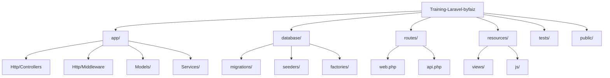
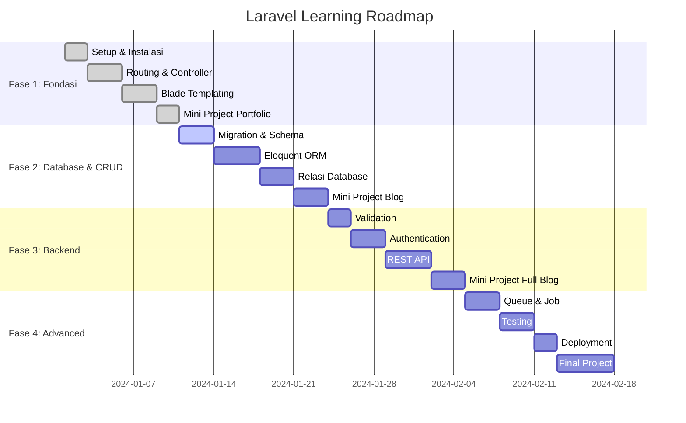

# 🚀 Pelatihan Laravel by Faiz

> *"Dari Nol Menjadi Laravel Hero — Belajar Backend dengan Cara Praktis"*

<p align="center">
  
</p>

<p align="center">
  
  
  
</p>

---

## 🌟 Selamat Datang di Bootcamp Laravel Paling Seru! 🎉

<p align="center">
  
</p>

Repository ini adalah sumber belajar **satu-step** untuk menguasai pengembangan backend menggunakan Laravel. Bukan cuma teori — tapi **hands-on coding** dengan skenario dunia nyata!

[](https://php.net)
[](https://laravel.com)
[](https://mysql.com)
[](LICENSE)

---

## 📖 Daftar Isi

<!-- animated table of contents -->
<table>
<tr>
<td width="50%">
  
- [🌟 Kenapa Repository Ini?](#-kenapa-repository-ini)
- [🎯 Tujuan Pembelajaran](#-tujuan-pembelajaran)
- [🛠️ Tech Stack](#️-tech-stack)
- [📂 Struktur Project](#-struktur-project)
- [📚 Jalur Belajar](#-jalur-belajar)
- [🚀 Panduan Cepat Memulai](#-panduan-cepat-memulai)

</td>
<td width="50%">

- [📋 Contoh Project: Sistem Blog](#-contoh-project-sistem-blog)
- [🧪 Testing API](#-testing-api)
- [📈 Roadmap Pengembangan](#-roadmap-pengembangan)
- [🤝 Cara Berkontribusi](#-cara-berkontribusi)
- [❓ FAQ](#-faq)
- [📄 Lisensi](#-lisensi)

</td>
</tr>
</table>

---

## 🌟 Kenapa Repository Ini?

<p align="center">
  
</p>

Ini bukan sekadar tutorial biasa — ini adalah **bootcamp terstruktur dan hands-on** yang dirancang dengan skenario dunia nyata. Setiap konsep diperkuat dengan contoh praktis, latihan, dan project akhir.

### ✨ Yang Membuat Ini Spesial:

<div align="center">
  
| 🎯 | ✨ | 💡 | 🚀 |
|---|---|---|---|
| **Belajar sambil praktek** | **Tingkat kesulitan bertahap** | **Pola dunia nyata** | **Cakupan komprehensif** |
| Setiap topik dilengkapi kode yang bisa langsung dijalankan | Konsep dibangun secara logis dari dasar ke lanjutan | Kode mengikuti best practice industri | Dari `php artisan serve` hingga deployment |

</div>

---

## 🎯 Tujuan Pembelajaran

<p align="center">
  
</p>

Pada akhir pelatihan ini, Anda akan mampu:

<div align="center">
  
| Skill | Deskripsi | Level |
|-------|-----------|-------|
| 🏗️ **Arsitektur** | Memahami pola MVC Laravel dan service container | 🟢🟢🟢🟢⚪ |
| 📊 **Database** | Mendesain skema, migrasi, dan Eloquent ORM | 🟢🟢🟢🟢🟢 |
| 🔐 **Keamanan** | Autentikasi, otorisasi, dan validasi data | 🟢🟢🟢🟢⚪ |
| 📡 **API** | REST API dengan Sanctum dan API Resources | 🟢🟢🟢🟢⚪ |
| ⚡ **Performansi** | Optimasi query, caching, dan queue | 🟢🟢🟢⚪⚪ |
| 🚢 **Deployment** | Deploy aplikasi ke server produksi | 🟢🟢⚪⚪⚪ |

</div>

---

## 🛠️ Tech Stack

<div align="center">
  
| Kategori | Teknologi | Versi | Ikon |
|----------|-----------|-------|------|
| **Bahasa** | PHP | 8.1+ |  |
| **Framework** | Laravel | 11.x |  |
| **Database** | MySQL / MariaDB | 5.7+ / 10.2+ |  |
| **Package Manager** | Composer | 2.x |  |
| **Testing API** | Postman | Terbaru |  |
| **Version Control** | Git & GitHub | — |  |
| **Development** | Laravel Sail (Docker) | Opsional |  |

</div>

---

## 📂 Struktur Project



```
📦 Training-Laravel-byfaiz/
├── 📁 app/                    # Logika inti aplikasi
│   ├── 📁 Http/
│   │   ├── 📁 Controllers/    # 🎮 Menangani HTTP request
│   │   ├── 📁 Middleware/     # 🔒 Filter request
│   │   └── 📁 Requests/       # ✅ Validasi form
│   ├── 📁 Models/             # 🗄️ Model Eloquent
│   └── 📁 Services/           # 💼 Layer logika bisnis
│
├── 📁 database/
│   ├── 📁 migrations/         # 📅 Version control skema database
│   ├── 📁 seeders/            # 🌱 Populasi data uji
│   └── 📁 factories/          # 🏭 Factory model
│
├── 📁 routes/
│   ├── web.php                # 🌐 Route web (Blade)
│   └── api.php                # 📡 Route API (REST)
│
├── 📁 resources/
│   ├── 📁 views/              # 🎨 Template Blade
│   └── 📁 js/                 # ⚛️ Asset frontend
│
├── 📁 tests/                  # 🧪 PHPUnit & Feature tests
├── 📁 public/                 # 🚪 Entry point publik
├── 📄 .env.example            # ⚙️ Template environment
└── 📄 artisan                 # 🛠️ CLI Laravel
```

---

## 📚 Jalur Belajar

<p align="center">
  
</p>

### 🟢 Fase 1: Fondasi
> *Kenali dasar-dasar Laravel*

| Topik | Yang Akan Dipelajari | Latihan Praktik | Durasi |
|-------|---------------------|-----------------|--------|
| Instalasi | Setup Laravel via Composer & Laravel Sail | Buat project pertama | 🕐 1 jam |
| Routing | Route web, parameter route, named route | Bangun website portfolio sederhana | 🕐 2 jam |
| Controller | Resource controller, dependency injection | Pindahkan route ke controller | 🕐 1.5 jam |
| Blade Templating | Layout, component, directive | Buat template UI yang reusable | 🕐 2 jam |

**📝 Mini Project**: Portfolio Pribadi dengan halaman dinamis

---

### 🟡 Fase 2: Database & CRUD
> *Kuasai pengelolaan data dan relasi*

| Topik | Yang Akan Dipelajari | Latihan Praktik | Durasi |
|-------|---------------------|-----------------|--------|
| Migration | Schema builder, mengubah tabel | Desain skema database blog | 🕐 2 jam |
| Eloquent ORM | Model, operasi CRUD, query scope | Implementasi CRUD post | 🕐 3 jam |
| Relasi | One-to-many, many-to-many, polymorphic | Tambah sistem komentar & tag | 🕐 3 jam |
| Seeder & Factory | Membuat data palsu | Populasi database dengan 100+ post | 🕐 1.5 jam |

**📝 Mini Project**: Sistem Blog dengan Post, Kategori, dan Komentar

---

### 🟠 Fase 3: Pengembangan Backend
> *Bangun aplikasi yang robust dan aman*

| Topik | Yang Akan Dipelajari | Latihan Praktik | Durasi |
|-------|---------------------|-----------------|--------|
| Validasi | Form request, custom rule | Amankan semua input form | 🕐 2 jam |
| Autentikasi | Laravel Breeze / Jetstream | Implementasi registrasi user | 🕐 3 jam |
| Otorisasi | Policy, Gate | Permission berbasis role | 🕐 2 jam |
| REST API | Route API, respons JSON | Buat API endpoint blog | 🕐 3 jam |
| API Resource | Transformasi data | Format respons API konsisten | 🕐 2 jam |

**📝 Mini Project**: Platform Blog Lengkap dengan Admin Panel & REST API

---

### 🔴 Fase 4: Konsep Lanjutan
> *Tingkatkan skill ke level produksi*

| Topik | Yang Akan Dipelajari | Latihan Praktik | Durasi |
|-------|---------------------|-----------------|--------|
| File Storage | Upload, resize, cloud storage | Tambah foto profil & gambar post | 🕐 2 jam |
| Queue & Job | Proses background | Kirim email welcome secara asinkron | 🕐 2.5 jam |
| Event & Listener | Arsitektur decoupled | Catat aktivitas user | 🕐 2 jam |
| Caching | Redis, strategi cache | Optimasi data yang sering diakses | 🕐 2 jam |
| Testing | PHPUnit, feature test | Tulis test untuk fitur kritis | 🕐 3 jam |
| Deployment | Konfigurasi env, optimasi | Deploy ke VPS / Laravel Forge | 🕐 2 jam |

**📝 Final Project**: CMS Siap Produksi dengan semua fitur terintegrasi

---

## 📊 Progress Tracker

<p align="center">
  
</p>

<details>
<summary><b>✅ Klik untuk melihat Progress Tracker</b></summary>

### ✅ Fase 1: Fondasi
- [ ] Instalasi Laravel & Environment Setup
- [ ] Routing & Controller
- [ ] Blade Templating
- [ ] **Mini Project**: Portfolio Pribadi

### ✅ Fase 2: Database & CRUD
- [ ] Migration & Schema Design
- [ ] Eloquent ORM & CRUD
- [ ] Relasi Database
- [ ] Seeder & Factory
- [ ] **Mini Project**: Sistem Blog Sederhana

### ✅ Fase 3: Backend Development
- [ ] Validation & Form Request
- [ ] Authentication (Breeze/Jetstream)
- [ ] Authorization (Policy & Gate)
- [ ] REST API Development
- [ ] **Mini Project**: Blog dengan Admin Panel

### ✅ Fase 4: Advanced Concepts
- [ ] File Storage & Upload
- [ ] Queue & Job
- [ ] Event & Listener
- [ ] Caching Strategy
- [ ] Unit Testing
- [ ] **Final Project**: CMS Production Ready

</details>

---

## 💻 Contoh Kode Praktis

<p align="center">
  
</p>

### 📝 Contoh 1: Membuat Model dengan Migration
```bash
php artisan make:model Post -m
```

```php
// database/migrations/xxxx_create_posts_table.php
public function up()
{
    Schema::create('posts', function (Blueprint $table) {
        $table->id();
        $table->foreignId('user_id')->constrained()->onDelete('cascade');
        $table->string('title');
        $table->string('slug')->unique();
        $table->text('content');
        $table->enum('status', ['draft', 'published'])->default('draft');
        $table->timestamp('published_at')->nullable();
        $table->timestamps();
    });
}
```

### 📝 Contoh 2: Resource Controller dengan API Resource
```php
// app/Http/Controllers/PostController.php
namespace App\Http\Controllers;

use App\Http\Resources\PostResource;
use App\Models\Post;
use App\Http\Requests\StorePostRequest;

class PostController extends Controller
{
    public function index()
    {
        $posts = Post::with('user', 'comments')
            ->latest()
            ->paginate(10);
            
        return PostResource::collection($posts);
    }

    public function store(StorePostRequest $request)
    {
        $post = auth()->user()->posts()->create($request->validated());
        
        return (new PostResource($post))
            ->additional(['message' => 'Post created successfully']);
    }
}
```

### 📝 Contoh 3: Form Request dengan Validasi
```php
// app/Http/Requests/StorePostRequest.php
namespace App\Http\Requests;

use Illuminate\Foundation\Http\FormRequest;

class StorePostRequest extends FormRequest
{
    public function authorize(): bool
    {
        return auth()->check();
    }

    public function rules(): array
    {
        return [
            'title' => 'required|string|max:255|unique:posts',
            'content' => 'required|string|min:100',
            'status' => 'in:draft,published',
            'published_at' => 'nullable|date',
        ];
    }

    public function messages(): array
    {
        return [
            'title.required' => 'Judul wajib diisi',
            'title.unique' => 'Judul sudah digunakan',
            'content.min' => 'Konten minimal 100 karakter',
        ];
    }
}
```

---

## 🚀 Panduan Cepat Memulai

<p align="center">
  
</p>

### Prasyarat
- ✅ PHP 8.1 atau lebih tinggi
- ✅ Composer
- ✅ MySQL 5.7+
- ✅ Node.js & NPM (untuk asset frontend)
- ✅ Git

### Langkah Instalasi

<details>
<summary><b>📦 Klik untuk melihat langkah instalasi lengkap</b></summary>

#### 1. Clone Repository
```bash
git clone https://github.com/faiz-jihad/Training-Laravel-byfaiz.git
cd Training-Laravel-byfaiz
```

#### 2. Install Dependencies
```bash
composer install
npm install && npm run build   # Jika menggunakan asset frontend
```

#### 3. Konfigurasi Environment
```bash
cp .env.example .env
php artisan key:generate
```

#### 4. Konfigurasi Database
Edit file `.env` dengan kredensial database Anda:
```env
DB_CONNECTION=mysql
DB_HOST=127.0.0.1
DB_PORT=3306
DB_DATABASE=laravel_training
DB_USERNAME=root
DB_PASSWORD=
```

#### 5. Jalankan Migrasi & Seeder
```bash
php artisan migrate
php artisan db:seed   # Isi dengan data contoh
```

#### 6. Jalankan Server Development
```bash
php artisan serve
# Buka http://localhost:8000
```

#### 7. (Opsional) Jalankan dengan Laravel Sail
```bash
./vendor/bin/sail up -d
./vendor/bin/sail artisan migrate
```

</details>

---

## ⚡ Laravel Command Cheat Sheet

<p align="center">
  
</p>

<details>
<summary><b>🔧 Klik untuk melihat Command Cheat Sheet</b></summary>

### Daily Commands
```bash
# Start development server
php artisan serve

# Make model with migration, factory, seeder
php artisan make:model Post -mfsc

# Clear all cache
php artisan optimize:clear

# Create new controller
php artisan make:controller PostController --resource

# Run tinker (interactive REPL)
php artisan tinker
```

### Database Commands
```bash
# Create migration
php artisan make:migration create_posts_table

# Run migrations
php artisan migrate

# Rollback last migration
php artisan migrate:rollback

# Create seeder
php artisan make:seeder PostSeeder

# Run seeder
php artisan db:seed --class=PostSeeder
```

### Cache Commands
```bash
# Clear all cache
php artisan optimize:clear

# Clear route cache
php artisan route:clear

# Clear config cache
php artisan config:clear

# Clear view cache
php artisan view:clear
```

</details>

---

## 📋 Contoh Project: Sistem Blog

<p align="center">
  
</p>

Sepanjang pelatihan ini, Anda akan membangun sistem blog lengkap. Berikut preview-nya:

### ✨ Fitur

<div align="center">
  
| ✍️ | 🏷️ | 💬 | 🔍 | 📊 | 📱 | 🖼️ |
|---|---|---|---|---|---|---|
| **Autentikasi User** | **Manajemen Post** | **Kategori & Tag** | **Sistem Komentar** | **Pencarian** | **Dashboard Admin** | **REST API** | **Media Library** |
| Register, login, profil | Create, edit, delete | Organisasi konten | Komentar bertingkat | Full-text search | Statistik & manajemen | Endpoint mobile-ready | Upload & kelola gambar |

</div>

### 🗄️ Skema Database

```mermaid
erDiagram
    users ||--o{ posts : creates
    users ||--o{ comments : writes
    categories ||--o{ posts : contains
    posts ||--o{ comments : has
    
    users {
        id PK
        string name
        string email
        string password
    }
    
    posts {
        id PK
        user_id FK
        category_id FK
        string title
        string slug
        text content
        datetime published_at
    }
    
    categories {
        id PK
        string name
        string slug
    }
    
    comments {
        id PK
        user_id FK
        post_id FK
        parent_id FK
        text content
    }
```

---

## 🧪 Testing API

<p align="center">
  
</p>

### 📡 Contoh Endpoint API

<div align="center">
  
| Method | Endpoint | Deskripsi | Auth |
|--------|----------|-----------|------|
| POST | `/api/register` | Buat akun baru | ❌ |
| POST | `/api/login` | Autentikasi user | ❌ |
| GET | `/api/posts` | Daftar semua post | ❌ |
| GET | `/api/posts/{id}` | Detail post | ❌ |
| POST | `/api/posts` | Buat post baru | ✅ |
| PUT | `/api/posts/{id}` | Update post | ✅ |
| DELETE | `/api/posts/{id}` | Hapus post | ✅ |
| POST | `/api/logout` | Logout user | ✅ |

</div>

### 🔧 Testing dengan Postman

1. Import collection: `postman_collection.json`
2. Set environment variable `{{base_url}}` ke `http://localhost:8000`
3. Uji alur autentikasi
4. Gunakan bearer token untuk route yang terproteksi

---

## 📈 Roadmap Pengembangan

<p align="center">
  
</p>

<div align="center">
  


</div>

---

## 💪 Weekly Coding Challenge

<p align="center">
  
</p>

Setiap minggu, coba selesaikan tantangan berikut:

| Minggu | Challenge | Skill Focus | Difficulty |
|--------|-----------|-------------|------------|
| 1 | Buat halaman portfolio dengan 3 route berbeda | Routing | 🟢 Mudah |
| 2 | Buat sistem TODO list dengan CRUD lengkap | CRUD | 🟢 Mudah |
| 3 | Implementasi login dengan middleware auth | Auth | 🟡 Sedang |
| 4 | Buat REST API untuk manajemen produk | API | 🟡 Sedang |
| 5 | Tambahkan fitur upload gambar untuk produk | Storage | 🟡 Sedang |
| 6 | Implementasikan queue untuk email notifikasi | Queue | 🔴 Sulit |
| 7 | Buat sistem caching untuk halaman populer | Cache | 🔴 Sulit |
| 8 | Tulis unit test untuk semua fitur | Testing | 🔴 Sulit |

---

## 🔧 Troubleshooting Umum

<p align="center">
  
</p>

<details>
<summary><b>🐛 Klik untuk melihat solusi masalah umum</b></summary>

| Masalah | Solusi |
|---------|--------|
| `Class '...' not found` | Jalankan `composer dump-autoload` |
| `SQLSTATE[HY000] [2002]` | Cek koneksi database di file `.env` |
| `419 Page Expired` | Pastikan ada `@csrf` di form Blade |
| `Target class [Controller] does not exist` | Hapus `namespace` di `routes/web.php` atau gunakan import class |
| `Unable to locate model` | Cek namespace model di controller |
| `403 Forbidden` | Cek middleware atau permission |
| `500 Server Error` | Cek log di `storage/logs/laravel.log` |

</details>

---

## 📚 Resource Belajar Tambahan

<p align="center">
  
</p>

<details>
<summary><b>📖 Klik untuk melihat resource belajar</b></summary>

### 📖 Dokumentasi Resmi
- [Laravel Documentation](https://laravel.com/docs) - Dokumentasi resmi
- [Laravel News](https://laravel-news.com/) - Berita dan tutorial terbaru
- [Laracasts](https://laracasts.com/) - Video tutorial berkualitas

### 🎥 Channel YouTube Rekomendasi (Bahasa Indonesia)
- [Web Programming UNPAS](https://www.youtube.com/@sandhikagalih) - Laravel untuk pemula
- [Programmer Zaman Now](https://www.youtube.com/@ProgrammerZamanNow) - Tutorial mendalam
- [Kelas Terbuka](https://www.youtube.com/@KelasTerbuka) - Konsep dasar PHP & Laravel

### 📚 Buku Referensi
- "Laravel: Up & Running" oleh Matt Stauffer
- "Laravel Design Patterns" oleh Enes Ekinci
- "Eloquent JavaScript" oleh Marijn Haverbeke

</details>

---

## 🤝 Cara Berkontribusi

<p align="center">
  
</p>

Kontribusi adalah yang membuat komunitas open-source menjadi tempat yang luar biasa. Setiap kontribusi Anda **sangat dihargai**.

### 🌟 Cara Berkontribusi
- 🐛 **Laporkan bug** — Buka issue dengan langkah detail
- 📝 **Perbaiki dokumentasi** — Koreksi typo, tambah contoh
- 💡 **Saran fitur** — Bagikan ide Anda untuk improvement
- 🔧 **Kirim PR** — Perbaiki issue atau tambah fitur baru

### 🔄 Proses Kontribusi
```bash
# 1. Fork project
# 2. Buat branch fitur
git checkout -b fitur/FiturKeren

# 3. Commit perubahan
git commit -m '✨ Menambah fitur keren'

# 4. Push ke branch
git push origin fitur/FiturKeren

# 5. Buka Pull Request
```

### 📋 Standar Coding
- Ikuti standar PSR-12
- Tulis pesan commit yang bermakna
- Tambah test untuk fitur baru
- Update dokumentasi yang relevan

---

## ❓ FAQ

<p align="center">
  
</p>

<details>
<summary><b>❓ Klik untuk melihat FAQ</b></summary>

### Q: Saya benar-benar baru di PHP. Apakah bisa mengikuti?
**A:** Bisa! Meskipun pengetahuan PHP dasar membantu, pelatihan ini dimulai dari fundamental. Kami sarankan untuk refresh PHP dasar terlebih dahulu.

### Q: Berapa lama waktu yang dibutuhkan?
**A:** Sekitar 8-10 minggu dengan latihan konsisten (10-15 jam/minggu). Anda bisa menyesuaikan kecepatan sesuai jadwal.

### Q: Apakah perlu Docker?
**A:** Tidak, Docker opsional. Anda bisa menggunakan XAMPP, MAMP, atau environment PHP lokal.

### Q: Apakah ada komunitas untuk diskusi?
**A:** Ya! Bergabunglah dengan komunitas kami untuk diskusi, tanya jawab, dan networking.

### Q: Apakah ini akan diupdate untuk Laravel 12?
**A:** Tentu! Kami akan terus mengupdate pelatihan ini sesuai versi Laravel terbaru.

### Q: Apakah ada sertifikat setelah selesai?
**A:** Untuk saat ini belum ada sertifikat resmi, tapi Anda akan memiliki portfolio project yang bisa ditunjukkan ke recruiter!

</details>

---

## 💬 Butuh Bantuan?

<p align="center">
  <a href="https://discord.gg/your-invite">
    
  </a>
  <a href="https://t.me/your-group">
    
  </a>
  <a href="https://wa.me/your-link">
    
  </a>
</p>

**Jam Konsultasi**: Senin-Jumat, 19:00-21:00 WIB

---

## 🌟 Quote of the Day

<p align="center">
  
</p>

---

## 🌟 Dukung Project Ini

Jika repository ini membantu Anda:

<p align="center">
  <a href="https://github.com/faiz-jihad/Training-Laravel-byfaiz">
    
  </a>
  <a href="https://github.com/faiz-jihad/Training-Laravel-byfaiz">
    
  </a>
  <a href="https://github.com/faiz-jihad/Training-Laravel-byfaiz">
    
  </a>
</p>

**Jangan lupa ⭐️ repository ini agar lebih mudah ditemukan oleh orang lain!**

---

## 📞 Hubungi Saya

<p align="center">
  <a href="https://github.com/faiz-jihad">
    
  </a>
  <a href="https://linkedin.com/in/faiz-jihad">
    
  </a>
  <a href="https://twitter.com/faizjihad">
    
  </a>
  <a href="mailto:faiz@example.com">
    
  </a>
</p>

---

## 📄 Lisensi

Project ini dilisensikan di bawah **Lisensi MIT** — bebas digunakan untuk belajar, mengajar, atau membangun project sendiri.

```
MIT License

Copyright (c) 2024 Faiz Jihad

Dengan ini diberikan izin, tanpa biaya, kepada siapa pun yang mendapatkan salinan
perangkat lunak ini dan file dokumentasi terkait, untuk menggunakannya tanpa batasan...
```

---

<p align="center">
  
</p>

<p align="center">
  <b>🔥 Selamat Koding! Ingat: Setiap ahli dulunya adalah pemula. Teruslah maju! 🚀</b>
</p>

---

*Terakhir Diupdate: November 2026*  
*Kompatibel dengan Laravel 13.x*

---
